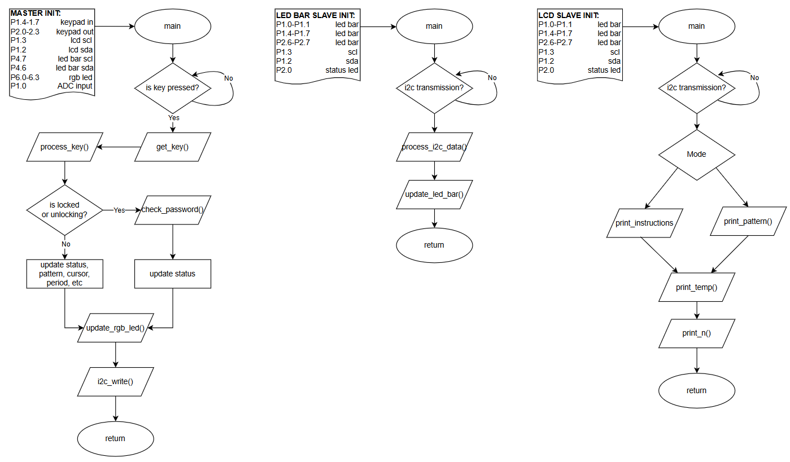
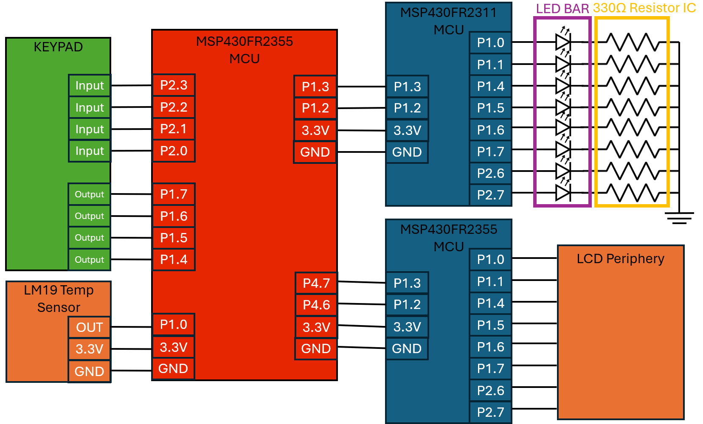

# Project 5 - Demo

## Team Members
Jay Graham, Kyle Stopplecamp

## Introduction
This project involves building a microcontroller-based system using the MSP430 to control a temperature monitoring and display setup. A master MSP430 samples temperature data from an LM19 sensor, computes a moving average using a circular buffer, and sends the results to two slave MSP430s via I2C. One slave updates an LCD with temperature and system status, while the other controls an LED bar to reflect selected patterns. The system also includes a keypad for user input, supporting unlocking and adjusting settings like the averaging window and LED pattern.

### High-Level Flowcharts

### Circuit Diagram

### Software Architecture

## DEMO
Done with TA or Trevor on 4/8/25

## Review of Results
| Requirement/specification                                                                                 | Points |   Jay     |   Kyle    |
|-----------------------------------------------------------------------------------------------------------|--------|-----------|-----------|
| **Presentation**                                                                                          |        |           |           |
| Introduction                                                                                              | 1      |           |     1     |
| Circuit diagram                                                                                           | 1      |           |     1     |
| System architecture diagram                                                                               | 1      |           |     1     |
| High-level flowchart                                                                                      | 1      |     1     |           |
| Professional demo                                                                                         | 2      |     1     |     1     |
| **Project Requirements**                                                                                  |        |           |           |
| The system must sample an LM19 temperature sensor.                                                        | 2      |     2     |           |
| Sample the temperature sensor every 0.5 s.                                                                | 0.5    |     .5    |           |
| The system must calculate a moving average of n temperature values.                                       | 1      |     1     |           |
| The default window size is n = 3.                                                                         | 0.5    |     .5    |           |
| The window size will be displayed in the bottom-right corner of the LCD.                                  | 0.5    |           |    .5     |
| In the "window size entry" state, the LCD will display "set window size" on the first line of the LCD:    | 0.5    |           |    .5     |
| When unlocked, the user can select a button on the keypad to enter the "window size entry" state.         | 0.5    |     .5    |           |
| The user can enter a single-digit number greater than 0 on the keypad to set the window size.             | 1      |     1     |           |
| After the user has entered the window size, the system should exit the "window size entry" state.         | 0.5    |     .5    |           |
| In the "pattern number entry" state, the LCD will display "set pattern" on the first line of the LCD:     | 0.5    |           |    .5     |
| When unlocked, the user can select a button on the keypad to enter the "pattern number entry" state.      | 0.5    |     .5    |           |
| In the "pattern number entry" state, the user can enter a number on the keypad to select the LED pattern. | 1      |     1     |           |
| After the user has entered the pattern number, the system should exit the "pattern number entry" state.   | 0.5    |     .5    |           |
| The temperature will be displayed in the bottom-left corner of the LCD.                                   | 0.5    |           |    .5     |
| The temperature will be displayed in degrees Celsius.                                                     | 2      |           |    2      |
| The temperature should not be displayed until n samples have been collected.                              | 0.5    |           |    .5     |
| The LED pattern name is displayed on the first line of the LCD:                                           | 0.5    |           |    .5     |
| After n samples have been collected, the new average temperature is displayed after every new sample.     | 0.5    |           |    .5     |
| The pattern name is only displayed when the system is unlocked and not in one of the "user entry" states. | 0.5    |           |    .5     |
| Total                                                                                                     | 20     |     10    |    10     |

## 🚀 Extra credit points
The extra credit points are allotted to both partners. You don't need to formally split these tasks. The points are just here for your information.

| Extra credit requirement/specification                                                                   | Extra Credit Points |
|----------------------------------------------------------------------------------------------------------|---------------------|
| The user can enter a multi-digit number for the window size                                              | 1          No       |
| The user can switch between displaying the temperature in Celsius and Fahrenheit                         | 1          Yes      |